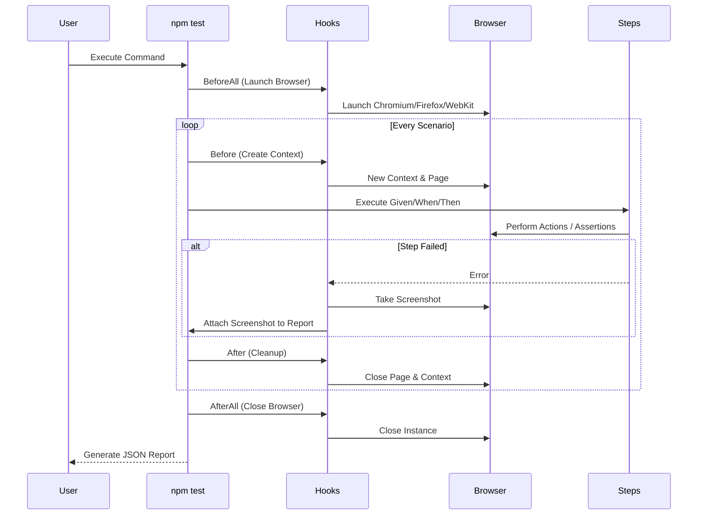

# Playwright BDD TypeScript Automation Framework

A robust, plug-and-play testing framework using **Playwright**, **Cucumber**, and **TypeScript**. 
Designed for scalability, ease of use, and comprehensive reporting.

## Key Features
- **BDD/Cucumber**: Write tests in plain English using Gherkin syntax.
- **TypeScript**: Type-safe code with modern features.
- **Page Object Model**: Modular and reusable page components.
- **Universal Steps**: Pre-built step definitions for common actions (Click, Fill, Verify) - *No coding required for basic flows!*
- **Reporting**: 
  - Console summary
  - Allure Report (Rich visual reporting)
  - Cucumber HTML Report (Single file summary)
- **CI/CD Ready**: GitLab CI and Github actions configuration included.
- **Accessibility Testing**: Integrated `axe-core` checks (Logs violations without failing by default).
- **API Testing**: Built-in context for API request validation.

## Prerequisites
- Node.js (v16+)
- NPM

## Installation
1. Clone framework (or fork).
2. Install dependencies:
   ```bash
   npm install
   ```
3. Install Playwright Browsers:
   ```bash
   npx playwright install
   ```

## Running Tests
### 1. Cross-Browser Testing
Run tests on different browsers using the npm scripts:
```bash
npm run test:chromium  # Default
npm run test:firefox
npm run test:webkit
```

### 2. Notifications (Slack & Jira)
Configure the `.env` file using `.env.example` as a template.
- **Slack**: Sends a summary of Pass/Fail tests to your channel.
- **Jira**: Automatically creates a **Bug** ticket if any tests fail.

To run tests with reporting and notifications:
```bash
npm test && npm run report && npm run notify
```
*Note: In CI/CD, you can chain these.*

## Reporting
Generate the HTML report after execution:
```bash
npm run report
```
The report will be available at `reports/cucumber_report.html`.

## Writing Tests
### 1. Feature Files
Create a `.feature` file in `features/`. Use the universal steps:
```gherkin
Feature: Login
  Scenario: Successful Login
    Given I navigate to "https://www.saucedemo.com/"
    When I fill "[data-test='username']" with "standard_user"
    And I fill "[data-test='password']" with "secret_sauce"
    And I click "[data-test='login-button']"
    Then I should see text "Products"
```

### 2. Page Objects (Optional)
For complex logic, create a new class in `src/pages` extending `BasePage`.

### 3. Step Definitions (Optional)
For custom logic, create a new `.ts` file in `src/steps`.

### 4. API Testing
We have included a dedicated example in `features/api.feature` and `src/steps/api.steps.ts` showing how to perform API testing:
- **GET Request**: `Given I send a GET request to "URL"`
- **POST Request**: `When I send a POST request to "URL" with body:`
- **Validation**: `Then the response status should be {int}`

### 5. Advanced Visual Testing
We use a robust manual comparison (backed by `pixelmatch` and `pngjs`) to ensure visual consistency.
- **Full Page**: `Then I verify the full page visual snapshot named "home_page"`
- **Component**: `Then I verify the visual snapshot of component ".header" named "header"`
- **Approving Changes**: If the UI changes intentionally, run:
  ```bash
  npm run test:visual:approve
  ```
  This will update the baseline images in `snapshots/`.

### 7. ROI & Cost Tracking
Calculate the business value of your automation with our built-in ROI calculator.
1.  **Configure**: Edit `roi-config.json` with your project's rates (Manual time per test, Hourly rate, etc.).
2.  **Run Tests**: `npm test`
3.  **Generate Report**: `npm run report:roi`
4.  **View Dashboard**: Open `reports/roi_dashboard.html` to see:
    - Time Saved
    - Cost Savings
    - Bug Prevention Value
    - Efficiency Improvements


## Project Structure
```
.
├── features/           # Feature files (.feature)
├── src/
│   ├── pages/          # Page Objects
│   ├── steps/          # Step Definitions (Universal steps included)
│   ├── support/        # Hooks & World Config
│   └── utils/          # Helpers (Axe, Reporters, etc.)
├── reports/            # Execution Artifacts
├── .gitlab-ci.yml      # CI Pipeline
├── cucumber.js         # Cucumber Config
└── tsconfig.json       # TypeScript Config
```


## Accessibility
Use the step `Then The page should be accessible` to verify a11y compliance. Violations are logged to the console and attached to the report.

## Framework Walkthrough

### 1. Universal Step Definitions
The framework includes `src/steps/general.steps.ts` with pre-built steps. You can use these immediately in any `.feature` file:

**Navigation**
- `Given I navigate to "URL"`

**Interaction**
- `When I click "selector"`
- `When I click the element containing text "text"`
- `When I fill "selector" with "value"`
- `When I select "option" from "selector"`

**Verification**
- `Then I should see "selector"`
- `Then I should see text "text"`
- `Then I should see "selector" containing text "text"`

**Utilities**
- `Then I wait for {int} seconds`

---

## Extending the Framework

### Adding New Reusable Steps
To create new steps for your team (e.g., a specific login flow or complex interaction):

1.  **Create a new file** in `src/steps/`.
    - Example: `src/steps/checkout.steps.ts`
2.  **Import Cucumber & World**:
    ```typescript
    import { Given, When, Then } from '@cucumber/cucumber';
    import { ICustomWorld } from '../support/CustomWorld';
    ```
3.  **Define your step**:
    ```typescript
    When('I complete the checkout for {string}', async function (this: ICustomWorld, item: string) {
        // Use standard Playwright methods
        await this.page.click(`text=${item}`);
        await this.page.click('#checkout-button');
    });
    ```
4.  **Use it in Feature files**:
    ```gherkin
    When I complete the checkout for "Backpack"
    ```

### Adding New Page Objects
For better organization of complex selectors and logic:
1.  Create a class in `src/pages/` extending `BasePage`.
2.  Define methods (e.g., `login()`, `search()`).
3.  Instantiate and use them within your Steps.

### 2. Complex Scenario (SauceDemo)
We have included a production-grade example in `features/saucedemo.feature`. This scenario performs an end-to-end e-commerce flow:
1.  Login against a real site (SauceDemo).
2.  Add items to cart.
3.  Navigate to cart.
4.  Checkout steps (fill form).
5.  Finish order.

This runs flawlessly using the **Universal Steps** without needing custom code for every action!

### 3. Reporting & Logging
- **Cucumber HTML Report**: A beautiful dashboard showing scenario status. `npm run report`
- **Execution Logs**: Detailed logs with timestamps are saved to `reports/logs/execution.log`.
- **Console Logs**: Real-time colored logs during execution.
- **Screenshots**: Automatically captured on failure (configured in `hooks.ts`).
- **Accessibility**: Integrated `axe-core` scans the page and logs violations.

### 4. CI/CD

## Tasks Accomplished
- [x] **Initialization & Configuration**
    - [x] Initialize Node.js project (`package.json`)
    - [x] Install dependencies (Playwright, Cucumber, TypeScript, Reporters, Utils)
    - [x] Configure `tsconfig.json`
    - [x] Configure `cucumber.js`
- [x] **Core Architecture**
    - [x] Create `CustomWorld` for context management (Page, Browser, API)
    - [x] Implement `Hooks` (Before, After, Screenshot on failure)
    - [x] Create `BasePage` with generic reusable methods
    - [x] Implement API Utils
    - [x] Implement Accessibility (`axe-core`) Utils
- [x] **Feature Implementation (Universal & Complex)**
    - [x] Create `general.steps.ts` with universal step definitions
    - [x] Create `complex_demo.feature` using a production-grade site (SauceDemo)
    - [x] Remove basic demo files
- [x] **Reporting**
    - [x] Setup Allure Reporter
    - [x] Setup Multiple Cucumber HTML Reporter
    - [x] Create helper script for report generation
    - [x] Ensure report generation on failure (posttest script)
- [x] **CI/CD**
    - [x] Create `.gitlab-ci.yml`
- [x] **Documentation & Finalize**
    - [x] Update `README.md` with comprehensive instructions
    - [x] Verify execution locally with new scenarios


- [x] **Advanced Logging**
    - [x] Install `winston`
    - [x] Create `src/utils/Logger.ts`
    - [x] Integrate Logger into `BasePage.ts`
    - [x] Integrate Logger into `hooks.ts`

## Technical Guide

### 1. Environment Management
We use `dotenv` for managing environments.
1.  Create `.env` file (copy from `.env.example`).
2.  Set `BASE_URL`, `API_KEY`, etc.
3.  Access in code via `process.env.BASE_URL`.

**Best Practice**: Never commit `.env` to Git. Use CI/CD secrets for production values.

### 2. Error Handling & Retries
- **Retries**: Configured in `cucumber.js` (default: 0). To enable retries for flaky tests, update the `retry` option:
  ```javascript
  // cucumber.js
  retry: 1
  ```
- **Screenshots**: Automatically captured on failure via `hooks.ts`.
- **Logs**: Check `reports/logs/execution.log` for stack traces and detailed execution flow.

### 3. Architecture
#### 3.1 Component Diagram
```mermaid
graph TD
    A[Test Runner (Cucumber)] --> B[Feature Files (.feature)]
    B --> C[Step Definitions (.ts)]
    C --> D[Page Objects (POM)]
    D --> E[Playwright (Browser Control)]
    C --> F[Custom World (Ctx/Verify)]
    G[Utils] --> H[Logger]
    G --> I[Reporters]
    G --> J[Axe (Accessibility)]
```

#### 3.2 Test Execution Flow



### 4. Code Quality
- **Linting**: `npm run lint` (ESLint)
- **Formatting**: `npm run format` (Prettier)
- **Pre-commit**: Husky ensures code quality before commit.

## Contributing
See [CONTRIBUTING.md](CONTRIBUTING.md) for guidelines....


